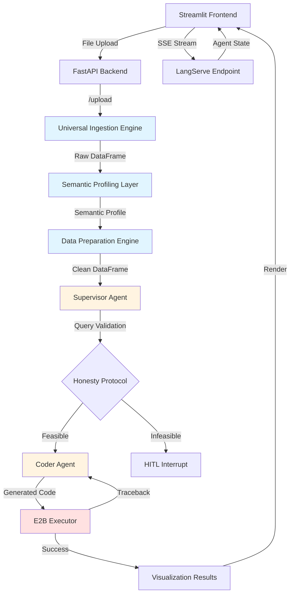
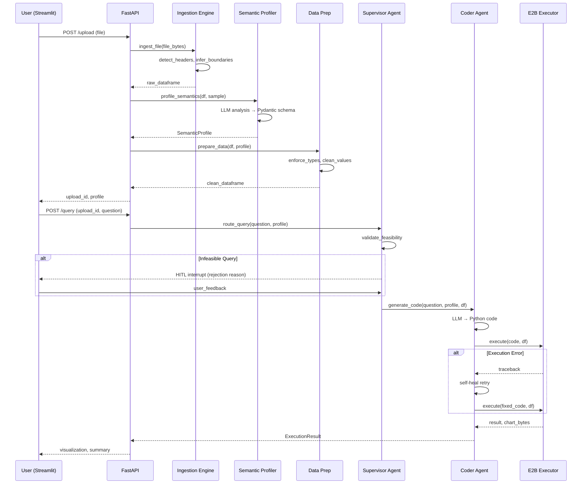

# Design Document: Axiom AI - Autonomous Data-to-Insight Agent MVP

## Overview

Axiom AI is an autonomous agent-driven pipeline that transforms unstructured, human-formatted data files into validated visual insights. The system ingests CSV and Excel files, semantically understands their structure and intent, performs in-memory data cleaning and transformation, and generates executable Python code for analysis and visualization. Built with FastAPI, LangGraph, and E2B for secure code execution, the system operates within strict memory constraints (512MB RAM) suitable for free-tier cloud deployment. The architecture emphasizes transparency through real-time agent state streaming, honesty protocols for rejecting infeasible requests, and human-in-the-loop validation checkpoints.

## Architecture



## Main Workflow Sequence



## Components and Interfaces

### Component 1: Universal Ingestion Engine

**Purpose**: Heuristically parse CSV and Excel files with messy human formatting, auto-detect headers and data boundaries, and produce clean Pandas DataFrames.

**Interface**:
```python
from typing import BinaryIO, Tuple
import pandas as pd

class IngestionEngine:
    def ingest_file(
        self, 
        file_bytes: BinaryIO, 
        filename: str
    ) -> Tuple[pd.DataFrame, dict]:
        """
        Ingest uploaded file and return cleaned DataFrame with metadata.
        
        Args:
            file_bytes: Binary file content
            filename: Original filename with extension
            
        Returns:
            Tuple of (DataFrame, metadata dict with detected properties)
        """
        pass
    
    def detect_header_row(self, df: pd.DataFrame) -> int:
        """Heuristically find the row index containing column headers."""
        pass
    
    def infer_data_boundaries(self, df: pd.DataFrame) -> Tuple[int, int]:
        """Find start and end row indices of actual data."""
        pass
```

**Responsibilities**:
- Accept CSV and Excel file uploads via FastAPI endpoint
- Auto-detect file encoding and delimiter for CSV files
- Skip empty leading rows and identify header row position
- Infer data boundaries (skip footer notes, totals rows)
- Handle memory constraints by chunking large files if needed
- Return standardized DataFrame with metadata about detected structure

**Memory Optimization Strategy**:
- Stream-read large files in chunks
- Drop empty columns and rows early
- Use categorical dtypes for string columns with low cardinality
- Monitor memory usage and reject files exceeding 400MB processed size


### Component 2: Semantic Profiling Layer

**Purpose**: Use LLM to understand the semantic meaning and functional intent of each column beyond raw data types.

**Interface**:
```python
from pydantic import BaseModel, Field
from typing import List, Literal

class ColumnProfile(BaseModel):
    """Semantic profile for a single column."""
    name: str
    raw_dtype: str
    semantic_type: Literal["id", "metric", "category", "datetime", "text", "boolean"]
    functional_role: Literal["identifier", "measure", "dimension", "timestamp", "description"]
    nullable: bool
    sample_values: List[str] = Field(max_length=5)
    inferred_constraints: dict = Field(default_factory=dict)

class SemanticProfile(BaseModel):
    """Complete semantic profile of the dataset."""
    columns: List[ColumnProfile]
    row_count: int
    primary_keys: List[str] = Field(default_factory=list)
    metrics: List[str] = Field(default_factory=list)
    dimensions: List[str] = Field(default_factory=list)
    temporal_columns: List[str] = Field(default_factory=list)

class SemanticProfiler:
    def profile_dataframe(self, df: pd.DataFrame) -> SemanticProfile:
        """
        Generate semantic profile using LLM analysis.
        
        Args:
            df: Raw DataFrame from ingestion
            
        Returns:
            Pydantic SemanticProfile with structured column metadata
        """
        pass
    
    def extract_sample(self, df: pd.DataFrame, n: int = 5) -> dict:
        """Extract representative sample rows for LLM analysis."""
        pass
```

**Responsibilities**:
- Extract column names and 5-row sample from DataFrame
- Construct LLM prompt with data sample and schema requirements
- Force LLM to return strict Pydantic JSON (SemanticProfile)
- Distinguish between raw types (string, int) and semantic intent (ID vs metric)
- Identify primary keys, metrics, dimensions, and temporal columns
- Cache profiles to avoid redundant LLM calls


### Component 3: Data Preparation Engine

**Purpose**: Perform in-memory data cleaning and transformation based on semantic profile using Pandas and DuckDB.

**Interface**:
```python
import duckdb

class DataPreparationEngine:
    def prepare_data(
        self, 
        df: pd.DataFrame, 
        profile: SemanticProfile
    ) -> pd.DataFrame:
        """
        Clean and transform DataFrame based on semantic profile.
        
        Args:
            df: Raw DataFrame
            profile: Semantic profile with type and constraint information
            
        Returns:
            Cleaned DataFrame with enforced types and handled nulls
        """
        pass
    
    def enforce_types(self, df: pd.DataFrame, profile: SemanticProfile) -> pd.DataFrame:
        """Convert columns to appropriate dtypes based on semantic types."""
        pass
    
    def clean_numeric_artifacts(self, series: pd.Series) -> pd.Series:
        """Strip currency symbols, percentages, commas from numeric columns."""
        pass
    
    def handle_missing_values(
        self, 
        df: pd.DataFrame, 
        profile: SemanticProfile
    ) -> pd.DataFrame:
        """Impute or drop missing values based on column role."""
        pass
    
    def deduplicate(self, df: pd.DataFrame, profile: SemanticProfile) -> pd.DataFrame:
        """Remove duplicate rows based on primary keys if identified."""
        pass
    
    def execute_duckdb_query(self, df: pd.DataFrame, query: str) -> pd.DataFrame:
        """Execute DuckDB SQL query on DataFrame for complex transformations."""
        pass
```

**Responsibilities**:
- Enforce semantic types (convert strings to datetime, numeric, categorical)
- Strip text artifacts from numeric columns (currency symbols, percentages, commas)
- Handle missing values with appropriate strategies (mean for metrics, mode for categories)
- Remove duplicate rows based on identified primary keys
- Provide DuckDB interface for complex SQL-based transformations
- Maintain strict in-memory processing (no disk writes)


### Component 4: Supervisor Agent (LangGraph)

**Purpose**: Orchestrate workflow routing, validate query feasibility, and implement honesty protocol with HITL checkpoints.

**Interface**:
```python
from langgraph.graph import StateGraph, END
from typing import TypedDict, Annotated, Literal

class AgentState(TypedDict):
    """Shared state across all agent nodes."""
    upload_id: str
    user_query: str
    semantic_profile: SemanticProfile
    dataframe: pd.DataFrame
    validation_result: dict
    generated_code: str
    execution_result: dict
    error_count: int
    human_feedback: str | None

class SupervisorAgent:
    def __init__(self):
        self.graph = self._build_graph()
    
    def _build_graph(self) -> StateGraph:
        """Construct LangGraph workflow with nodes and edges."""
        pass
    
    def validate_query_feasibility(self, state: AgentState) -> AgentState:
        """
        Use LLM to validate if query is answerable with available data.
        
        Returns updated state with validation_result containing:
        - feasible: bool
        - reasoning: str
        - required_columns: List[str]
        - missing_columns: List[str]
        """
        pass
    
    def route_decision(self, state: AgentState) -> Literal["coder", "hitl", "end"]:
        """Routing function to determine next node based on validation."""
        pass
    
    def hitl_interrupt(self, state: AgentState) -> AgentState:
        """Pause execution and request human feedback via interrupt."""
        pass
```

**Responsibilities**:
- Receive user query and semantic profile
- Validate query feasibility against available columns and data types
- Implement honesty protocol: reject infeasible requests before execution
- Route to Coder Agent if feasible, or HITL interrupt if infeasible
- Manage agent state across workflow steps
- Stream state updates to frontend via LangServe SSE


### Component 5: Coder Agent (LangGraph)

**Purpose**: Generate executable Python code for data analysis and visualization based on validated user queries.

**Interface**:
```python
from pydantic import BaseModel

class GeneratedCode(BaseModel):
    """Structured output from code generation LLM."""
    code: str = Field(description="Executable Python code")
    explanation: str = Field(description="Natural language explanation of approach")
    required_libraries: List[str] = Field(default_factory=list)
    expected_output_type: Literal["chart", "table", "metric", "text"]

class CoderAgent:
    def generate_code(self, state: AgentState) -> AgentState:
        """
        Generate Python code using LLM with structured output.
        
        Updates state with:
        - generated_code: str
        - code_explanation: str
        """
        pass
    
    def build_code_prompt(
        self, 
        query: str, 
        profile: SemanticProfile,
        df_head: str
    ) -> str:
        """Construct prompt with query, schema, and sample data."""
        pass
    
    def validate_code_safety(self, code: str) -> Tuple[bool, str]:
        """
        Basic static analysis to reject dangerous operations.
        
        Returns (is_safe, rejection_reason)
        """
        pass
```

**Responsibilities**:
- Receive validated query and semantic profile from Supervisor
- Construct LLM prompt with query, schema, and DataFrame sample
- Force LLM to return Pydantic GeneratedCode with structured fields
- Generate Python code using Pandas, Matplotlib, or Plotly
- Perform basic safety validation (reject file I/O, network calls, subprocess)
- Pass generated code to E2B Executor
- Handle execution errors with self-healing retry loop


### Component 6: E2B Executor

**Purpose**: Execute generated Python code in isolated E2B sandbox and return results or tracebacks.

**Interface**:
```python
from e2b_code_interpreter import CodeInterpreter
from typing import Optional

class ExecutionResult(BaseModel):
    """Structured execution result."""
    success: bool
    output: Optional[str] = None
    chart_base64: Optional[str] = None
    error: Optional[str] = None
    traceback: Optional[str] = None
    execution_time_ms: int

class E2BExecutor:
    def __init__(self, api_key: str):
        self.api_key = api_key
    
    def execute_code(
        self, 
        code: str, 
        dataframe: pd.DataFrame,
        timeout_seconds: int = 30
    ) -> ExecutionResult:
        """
        Execute code in E2B sandbox with DataFrame context.
        
        Args:
            code: Python code to execute
            dataframe: DataFrame to make available in execution context
            timeout_seconds: Maximum execution time
            
        Returns:
            ExecutionResult with output or error details
        """
        pass
    
    def serialize_dataframe(self, df: pd.DataFrame) -> str:
        """Convert DataFrame to format suitable for E2B context."""
        pass
    
    def extract_chart(self, execution_output: dict) -> Optional[str]:
        """Extract base64-encoded chart from execution results."""
        pass
```

**Responsibilities**:
- Initialize E2B CodeInterpreter session with API key
- Serialize DataFrame and inject into execution context
- Execute generated Python code in isolated sandbox
- Capture stdout, stderr, and generated visualizations
- Return structured ExecutionResult with success/failure status
- Handle timeouts and resource limits
- Extract base64-encoded charts for frontend rendering


### Component 7: FastAPI Backend

**Purpose**: Expose REST endpoints for file upload, query submission, and serve LangServe SSE streams.

**Interface**:
```python
from fastapi import FastAPI, UploadFile, HTTPException
from fastapi.responses import StreamingResponse
from langserve import add_routes

app = FastAPI()

class UploadResponse(BaseModel):
    upload_id: str
    filename: str
    row_count: int
    column_count: int
    semantic_profile: SemanticProfile

class QueryRequest(BaseModel):
    upload_id: str
    query: str

class QueryResponse(BaseModel):
    result_id: str
    status: Literal["processing", "completed", "failed"]
    visualization_url: Optional[str] = None
    summary: Optional[str] = None

@app.post("/upload", response_model=UploadResponse)
async def upload_file(file: UploadFile):
    """Upload and process data file."""
    pass

@app.post("/query", response_model=QueryResponse)
async def submit_query(request: QueryRequest):
    """Submit analysis query for uploaded dataset."""
    pass

@app.get("/result/{result_id}")
async def get_result(result_id: str):
    """Retrieve completed analysis result."""
    pass

# LangServe SSE endpoint for agent state streaming
add_routes(app, supervisor_agent.graph, path="/agent")
```

**Responsibilities**:
- Handle file uploads with size validation
- Orchestrate ingestion, profiling, and preparation pipeline
- Store processed DataFrames and profiles in memory cache (with TTL)
- Accept query requests and invoke Supervisor Agent
- Expose LangServe SSE endpoint for real-time agent state streaming
- Serve visualization results and summaries
- Implement rate limiting and memory monitoring


### Component 8: Streamlit Frontend

**Purpose**: Provide user interface for file upload, query input, agent log streaming, and visualization rendering.

**Interface**:
```python
import streamlit as st
import requests
from sseclient import SSEClient

class StreamlitApp:
    def __init__(self, api_base_url: str):
        self.api_url = api_base_url
    
    def render_upload_section(self):
        """Render file upload widget and handle submission."""
        pass
    
    def render_query_section(self, upload_id: str, profile: SemanticProfile):
        """Render query input and submission interface."""
        pass
    
    def stream_agent_logs(self, query_id: str):
        """
        Connect to LangServe SSE endpoint and stream agent state updates.
        
        Displays real-time agent thoughts, validations, and actions.
        """
        pass
    
    def render_visualization(self, result: QueryResponse):
        """Render final chart and summary."""
        pass
    
    def handle_hitl_interrupt(self, interrupt_data: dict):
        """Display HITL validation request and collect user feedback."""
        pass
```

**Responsibilities**:
- Provide file upload interface with drag-and-drop support
- Display semantic profile summary after upload
- Accept natural language queries from user
- Stream agent state updates from LangServe SSE endpoint in real-time
- Display agent reasoning, validations, and code generation steps
- Handle HITL interrupts with user feedback collection
- Render final visualizations (charts, tables, metrics)
- Display generated code and explanations for transparency


## Data Models

### Model 1: ColumnProfile

```python
class ColumnProfile(BaseModel):
    """Semantic profile for a single column."""
    name: str = Field(description="Column name from DataFrame")
    raw_dtype: str = Field(description="Pandas dtype as string")
    semantic_type: Literal["id", "metric", "category", "datetime", "text", "boolean"] = Field(
        description="Semantic interpretation of column purpose"
    )
    functional_role: Literal["identifier", "measure", "dimension", "timestamp", "description"] = Field(
        description="Functional role in analysis context"
    )
    nullable: bool = Field(description="Whether column contains null values")
    sample_values: List[str] = Field(
        max_length=5, 
        description="Up to 5 representative values"
    )
    inferred_constraints: dict = Field(
        default_factory=dict,
        description="Optional constraints like min/max, unique, enum values"
    )
```

**Validation Rules**:
- `name` must be non-empty string
- `raw_dtype` must be valid Pandas dtype string
- `semantic_type` must be one of predefined literals
- `sample_values` limited to 5 items maximum
- `inferred_constraints` can contain: min, max, unique, enum, pattern

### Model 2: SemanticProfile

```python
class SemanticProfile(BaseModel):
    """Complete semantic profile of the dataset."""
    columns: List[ColumnProfile] = Field(
        min_length=1,
        description="Profile for each column in dataset"
    )
    row_count: int = Field(gt=0, description="Number of data rows")
    primary_keys: List[str] = Field(
        default_factory=list,
        description="Column names identified as primary keys"
    )
    metrics: List[str] = Field(
        default_factory=list,
        description="Column names containing numeric measures"
    )
    dimensions: List[str] = Field(
        default_factory=list,
        description="Column names containing categorical dimensions"
    )
    temporal_columns: List[str] = Field(
        default_factory=list,
        description="Column names containing datetime values"
    )
```

**Validation Rules**:
- Must contain at least one column profile
- `row_count` must be positive integer
- All column name references in `primary_keys`, `metrics`, `dimensions`, `temporal_columns` must exist in `columns` list
- Column names must be unique across all lists


### Model 3: AgentState

```python
class AgentState(TypedDict):
    """Shared state across all LangGraph agent nodes."""
    upload_id: str
    user_query: str
    semantic_profile: SemanticProfile
    dataframe: pd.DataFrame
    validation_result: dict
    generated_code: str
    execution_result: dict
    error_count: int
    human_feedback: str | None
    messages: List[dict]  # LangChain message history
```

**Validation Rules**:
- `upload_id` must be valid UUID string
- `user_query` must be non-empty string
- `semantic_profile` must be valid SemanticProfile instance
- `dataframe` must be non-empty Pandas DataFrame
- `error_count` must be non-negative integer, max 3 retries
- `validation_result` must contain: feasible (bool), reasoning (str), required_columns (list)

### Model 4: GeneratedCode

```python
class GeneratedCode(BaseModel):
    """Structured output from code generation LLM."""
    code: str = Field(
        min_length=10,
        description="Executable Python code for analysis"
    )
    explanation: str = Field(
        min_length=20,
        description="Natural language explanation of approach"
    )
    required_libraries: List[str] = Field(
        default_factory=list,
        description="Python libraries used in code"
    )
    expected_output_type: Literal["chart", "table", "metric", "text"] = Field(
        description="Type of output the code will produce"
    )
```

**Validation Rules**:
- `code` must be at least 10 characters (prevent empty responses)
- `code` must not contain dangerous operations: `open()`, `os.system()`, `subprocess`, `eval()`, `exec()`, `__import__`
- `explanation` must be at least 20 characters
- `required_libraries` must only contain allowed libraries: pandas, numpy, matplotlib, plotly, seaborn
- `expected_output_type` must be one of predefined literals


### Model 5: ExecutionResult

```python
class ExecutionResult(BaseModel):
    """Structured execution result from E2B sandbox."""
    success: bool = Field(description="Whether execution completed without errors")
    output: Optional[str] = Field(
        None,
        description="Captured stdout from execution"
    )
    chart_base64: Optional[str] = Field(
        None,
        description="Base64-encoded chart image if visualization generated"
    )
    error: Optional[str] = Field(
        None,
        description="Error message if execution failed"
    )
    traceback: Optional[str] = Field(
        None,
        description="Full Python traceback if execution failed"
    )
    execution_time_ms: int = Field(
        ge=0,
        description="Execution duration in milliseconds"
    )
```

**Validation Rules**:
- If `success` is True, `error` and `traceback` must be None
- If `success` is False, `error` must be non-empty string
- `execution_time_ms` must be non-negative integer
- `chart_base64` must be valid base64 string if present
- At least one of `output` or `chart_base64` should be present if `success` is True

## Algorithmic Pseudocode

### Algorithm 1: File Ingestion with Header Detection

```python
def ingest_file(file_bytes: BinaryIO, filename: str) -> Tuple[pd.DataFrame, dict]:
    """
    Ingest uploaded file with automatic header detection and boundary inference.
    
    Preconditions:
        - file_bytes is valid binary stream
        - filename has valid extension (.csv, .xlsx, .xls)
        - file size < 100MB
    
    Postconditions:
        - Returns non-empty DataFrame with detected headers
        - Metadata dict contains: header_row, data_start_row, data_end_row
        - All empty leading/trailing rows removed
    
    Loop Invariants:
        - For header detection: candidate_row_index increases monotonically
        - For boundary detection: all examined rows maintain consistent column count
    """
    # Step 1: Determine file type and read initial data
    extension = filename.split('.')[-1].lower()
    
    if extension == 'csv':
        # Try multiple encodings and delimiters
        df_raw = read_csv_with_fallback(file_bytes)
    elif extension in ['xlsx', 'xls']:
        df_raw = pd.read_excel(file_bytes, header=None)
    else:
        raise ValueError(f"Unsupported file type: {extension}")
    
    # Step 2: Detect header row
    header_row_idx = detect_header_row(df_raw)
    
    # Step 3: Infer data boundaries
    data_start, data_end = infer_data_boundaries(df_raw, header_row_idx)
    
    # Step 4: Re-read with detected parameters
    if extension == 'csv':
        df_clean = pd.read_csv(file_bytes, header=header_row_idx, 
                                skiprows=range(0, header_row_idx),
                                nrows=data_end - data_start)
    else:
        df_clean = pd.read_excel(file_bytes, header=header_row_idx,
                                  nrows=data_end - data_start)
    
    # Step 5: Basic cleaning
    df_clean = df_clean.dropna(how='all', axis=1)  # Remove empty columns
    df_clean = df_clean.dropna(how='all', axis=0)  # Remove empty rows
    
    metadata = {
        'header_row': header_row_idx,
        'data_start_row': data_start,
        'data_end_row': data_end,
        'original_shape': df_raw.shape,
        'cleaned_shape': df_clean.shape
    }
    
    return df_clean, metadata
```


### Algorithm 2: Header Row Detection

```python
def detect_header_row(df: pd.DataFrame) -> int:
    """
    Heuristically identify the row containing column headers.
    
    Preconditions:
        - df is non-empty DataFrame
        - df has at least 2 rows
    
    Postconditions:
        - Returns row index >= 0 and < len(df)
        - Returned row has highest header score
    
    Loop Invariants:
        - best_score is maximum score seen so far
        - best_row_idx corresponds to row with best_score
    """
    best_score = -1
    best_row_idx = 0
    
    # Examine first 10 rows as potential headers
    for idx in range(min(10, len(df))):
        row = df.iloc[idx]
        score = 0
        
        # Heuristic 1: Non-null values (headers usually complete)
        non_null_ratio = row.notna().sum() / len(row)
        score += non_null_ratio * 10
        
        # Heuristic 2: String values (headers are text)
        string_ratio = sum(isinstance(v, str) for v in row) / len(row)
        score += string_ratio * 10
        
        # Heuristic 3: Unique values (headers should be distinct)
        unique_ratio = len(set(row.dropna())) / max(1, row.notna().sum())
        score += unique_ratio * 5
        
        # Heuristic 4: Short text length (headers are concise)
        avg_length = sum(len(str(v)) for v in row if pd.notna(v)) / max(1, row.notna().sum())
        if 5 <= avg_length <= 30:
            score += 5
        
        # Heuristic 5: No numeric-only row (headers contain text)
        if not all(isinstance(v, (int, float)) for v in row.dropna()):
            score += 3
        
        if score > best_score:
            best_score = score
            best_row_idx = idx
    
    return best_row_idx
```


### Algorithm 3: Semantic Profiling with LLM

```python
def profile_dataframe(df: pd.DataFrame, llm_client) -> SemanticProfile:
    """
    Generate semantic profile using LLM with structured output.
    
    Preconditions:
        - df is non-empty DataFrame with valid column names
        - llm_client is initialized LangChain LLM with JSON mode
        - df has at least 1 row
    
    Postconditions:
        - Returns valid SemanticProfile with all columns profiled
        - All column names in profile match df.columns
        - Semantic types assigned to all columns
    
    Loop Invariants: N/A (single LLM call, no loops)
    """
    # Step 1: Extract sample data
    sample_rows = df.head(5).to_dict(orient='records')
    column_info = []
    
    for col in df.columns:
        column_info.append({
            'name': col,
            'dtype': str(df[col].dtype),
            'null_count': int(df[col].isna().sum()),
            'sample_values': [str(v) for v in df[col].dropna().head(5).tolist()]
        })
    
    # Step 2: Construct LLM prompt
    prompt = f"""
    Analyze this dataset and provide a semantic profile.
    
    Dataset Info:
    - Total Rows: {len(df)}
    - Columns: {len(df.columns)}
    
    Column Details:
    {json.dumps(column_info, indent=2)}
    
    Sample Rows:
    {json.dumps(sample_rows, indent=2)}
    
    For each column, determine:
    1. semantic_type: id, metric, category, datetime, text, or boolean
    2. functional_role: identifier, measure, dimension, timestamp, or description
    3. Identify primary keys, metrics, dimensions, and temporal columns
    
    Return a JSON object matching the SemanticProfile schema.
    """
    
    # Step 3: Call LLM with structured output
    response = llm_client.with_structured_output(SemanticProfile).invoke(prompt)
    
    # Step 4: Validate response
    assert len(response.columns) == len(df.columns), "Column count mismatch"
    assert all(col.name in df.columns for col in response.columns), "Invalid column names"
    
    return response
```


### Algorithm 4: Data Preparation Pipeline

```python
def prepare_data(df: pd.DataFrame, profile: SemanticProfile) -> pd.DataFrame:
    """
    Clean and transform DataFrame based on semantic profile.
    
    Preconditions:
        - df is non-empty DataFrame
        - profile is valid SemanticProfile matching df columns
        - All column names in profile exist in df
    
    Postconditions:
        - Returns DataFrame with enforced types
        - Numeric columns cleaned of text artifacts
        - Missing values handled appropriately
        - Duplicates removed if primary keys identified
        - No disk I/O performed (strict in-memory)
    
    Loop Invariants:
        - For type enforcement loop: all previously processed columns have correct dtype
        - For cleaning loop: df shape remains consistent (rows may decrease, columns constant)
    """
    df_clean = df.copy()
    
    # Step 1: Enforce semantic types
    for col_profile in profile.columns:
        col_name = col_profile.name
        
        if col_profile.semantic_type == 'metric':
            # Clean numeric artifacts
            df_clean[col_name] = clean_numeric_artifacts(df_clean[col_name])
            df_clean[col_name] = pd.to_numeric(df_clean[col_name], errors='coerce')
        
        elif col_profile.semantic_type == 'datetime':
            df_clean[col_name] = pd.to_datetime(df_clean[col_name], errors='coerce')
        
        elif col_profile.semantic_type == 'category':
            df_clean[col_name] = df_clean[col_name].astype('category')
        
        elif col_profile.semantic_type == 'boolean':
            df_clean[col_name] = df_clean[col_name].map({
                'true': True, 'false': False, 'yes': True, 'no': False,
                '1': True, '0': False, 1: True, 0: False
            })
    
    # Step 2: Handle missing values
    for col_profile in profile.columns:
        col_name = col_profile.name
        
        if col_profile.functional_role == 'measure':
            # Impute metrics with median
            df_clean[col_name].fillna(df_clean[col_name].median(), inplace=True)
        
        elif col_profile.functional_role == 'dimension':
            # Impute categories with mode
            mode_value = df_clean[col_name].mode()[0] if not df_clean[col_name].mode().empty else 'Unknown'
            df_clean[col_name].fillna(mode_value, inplace=True)
        
        elif col_profile.functional_role == 'identifier':
            # Drop rows with missing identifiers
            df_clean = df_clean.dropna(subset=[col_name])
    
    # Step 3: Remove duplicates based on primary keys
    if profile.primary_keys:
        df_clean = df_clean.drop_duplicates(subset=profile.primary_keys, keep='first')
    
    # Step 4: Reset index
    df_clean = df_clean.reset_index(drop=True)
    
    return df_clean


def clean_numeric_artifacts(series: pd.Series) -> pd.Series:
    """
    Strip currency symbols, percentages, commas from numeric columns.
    
    Preconditions:
        - series is Pandas Series
    
    Postconditions:
        - Returns series with text artifacts removed
        - Numeric strings converted to clean format
    """
    if series.dtype == 'object':
        # Remove common artifacts
        series = series.astype(str)
        series = series.str.replace('$', '', regex=False)
        series = series.str.replace('€', '', regex=False)
        series = series.str.replace('£', '', regex=False)
        series = series.str.replace('%', '', regex=False)
        series = series.str.replace(',', '', regex=False)
        series = series.str.strip()
    
    return series
```


### Algorithm 5: Supervisor Agent Workflow (LangGraph)

```python
def build_supervisor_graph() -> StateGraph:
    """
    Construct LangGraph workflow for query orchestration.
    
    Preconditions:
        - LangGraph library installed and imported
        - All node functions defined
    
    Postconditions:
        - Returns compiled StateGraph ready for execution
        - Graph contains all required nodes and edges
        - Routing logic properly configured
    """
    workflow = StateGraph(AgentState)
    
    # Add nodes
    workflow.add_node("validate_query", validate_query_feasibility)
    workflow.add_node("hitl_interrupt", hitl_interrupt)
    workflow.add_node("generate_code", coder_agent.generate_code)
    workflow.add_node("execute_code", execute_code_node)
    workflow.add_node("handle_error", handle_execution_error)
    
    # Set entry point
    workflow.set_entry_point("validate_query")
    
    # Add conditional routing
    workflow.add_conditional_edges(
        "validate_query",
        route_after_validation,
        {
            "coder": "generate_code",
            "hitl": "hitl_interrupt",
            "end": END
        }
    )
    
    workflow.add_edge("hitl_interrupt", "validate_query")  # Loop back after feedback
    workflow.add_edge("generate_code", "execute_code")
    
    workflow.add_conditional_edges(
        "execute_code",
        route_after_execution,
        {
            "success": END,
            "retry": "handle_error",
            "fail": END
        }
    )
    
    workflow.add_edge("handle_error", "generate_code")  # Retry with error context
    
    return workflow.compile()


def validate_query_feasibility(state: AgentState) -> AgentState:
    """
    Validate if user query is answerable with available data.
    
    Preconditions:
        - state contains valid user_query and semantic_profile
        - LLM client initialized
    
    Postconditions:
        - state.validation_result contains feasibility assessment
        - If infeasible, reasoning explains why
        - If feasible, required_columns lists needed columns
    
    Loop Invariants: N/A (single LLM call)
    """
    prompt = f"""
    User Query: {state['user_query']}
    
    Available Data Schema:
    {json.dumps([col.dict() for col in state['semantic_profile'].columns], indent=2)}
    
    Determine if this query can be answered with the available data.
    
    Consider:
    1. Are all required columns present?
    2. Do column types support the requested analysis?
    3. Is the query semantically coherent?
    
    Return JSON with:
    - feasible: boolean
    - reasoning: string explanation
    - required_columns: list of column names needed
    - missing_columns: list of columns mentioned but not available
    """
    
    response = llm_client.with_structured_output(ValidationResult).invoke(prompt)
    
    state['validation_result'] = response.dict()
    return state


def route_after_validation(state: AgentState) -> str:
    """
    Routing function to determine next node after validation.
    
    Preconditions:
        - state.validation_result exists and contains 'feasible' key
    
    Postconditions:
        - Returns one of: "coder", "hitl", "end"
    """
    if state['validation_result']['feasible']:
        return "coder"
    else:
        # Check if user feedback already provided
        if state.get('human_feedback'):
            return "end"  # User declined to modify query
        else:
            return "hitl"  # Request human feedback
```


### Algorithm 6: Code Generation with Self-Healing

```python
def generate_code(state: AgentState) -> AgentState:
    """
    Generate executable Python code for analysis using LLM.
    
    Preconditions:
        - state contains validated query and semantic_profile
        - state.validation_result['feasible'] is True
        - LLM client supports structured output
    
    Postconditions:
        - state.generated_code contains executable Python code
        - Code passes basic safety validation
        - Code uses only allowed libraries
    
    Loop Invariants: N/A (single generation, retries handled at execution level)
    """
    # Build context for code generation
    df_sample = state['dataframe'].head(10).to_string()
    schema_info = "\n".join([
        f"- {col.name}: {col.semantic_type} ({col.functional_role})"
        for col in state['semantic_profile'].columns
    ])
    
    # Include error context if this is a retry
    error_context = ""
    if state.get('execution_result', {}).get('traceback'):
        error_context = f"""
        Previous attempt failed with error:
        {state['execution_result']['traceback']}
        
        Fix the error and generate corrected code.
        """
    
    prompt = f"""
    Generate Python code to answer this query:
    "{state['user_query']}"
    
    Available Data Schema:
    {schema_info}
    
    Sample Data (first 10 rows):
    {df_sample}
    
    {error_context}
    
    Requirements:
    1. Use pandas DataFrame named 'df' (already loaded)
    2. Generate visualization using matplotlib or plotly
    3. Save chart to 'output.png'
    4. Print summary statistics or insights
    5. Use only: pandas, numpy, matplotlib, plotly, seaborn
    6. No file I/O except saving chart
    7. No network calls or subprocess execution
    
    Return structured JSON with:
    - code: executable Python code
    - explanation: natural language explanation
    - required_libraries: list of libraries used
    - expected_output_type: chart, table, metric, or text
    """
    
    response = llm_client.with_structured_output(GeneratedCode).invoke(prompt)
    
    # Safety validation
    is_safe, rejection_reason = validate_code_safety(response.code)
    if not is_safe:
        raise ValueError(f"Generated code failed safety check: {rejection_reason}")
    
    state['generated_code'] = response.code
    state['code_explanation'] = response.explanation
    
    return state


def validate_code_safety(code: str) -> Tuple[bool, str]:
    """
    Perform basic static analysis to reject dangerous operations.
    
    Preconditions:
        - code is non-empty string
    
    Postconditions:
        - Returns (True, "") if code is safe
        - Returns (False, reason) if code contains dangerous patterns
    """
    dangerous_patterns = [
        ('os.system', 'System command execution not allowed'),
        ('subprocess', 'Subprocess execution not allowed'),
        ('eval(', 'eval() function not allowed'),
        ('exec(', 'exec() function not allowed'),
        ('__import__', 'Dynamic imports not allowed'),
        ('open(', 'File operations not allowed (except chart saving)'),
        ('requests.', 'Network requests not allowed'),
        ('urllib', 'Network requests not allowed'),
        ('socket', 'Socket operations not allowed'),
    ]
    
    # Allow open() only for saving chart
    if 'open(' in code and 'output.png' not in code:
        return False, 'File operations not allowed except for chart saving'
    
    for pattern, reason in dangerous_patterns:
        if pattern in code:
            return False, reason
    
    return True, ""
```


### Algorithm 7: E2B Code Execution with Retry Logic

```python
def execute_code_node(state: AgentState) -> AgentState:
    """
    Execute generated code in E2B sandbox with retry logic.
    
    Preconditions:
        - state.generated_code contains valid Python code
        - state.dataframe is non-empty DataFrame
        - E2B API key configured
        - error_count < 3 (max retries)
    
    Postconditions:
        - state.execution_result contains ExecutionResult
        - If successful: result contains output and/or chart
        - If failed: result contains error and traceback
        - error_count incremented on failure
    
    Loop Invariants: N/A (single execution per call, retries via graph edges)
    """
    executor = E2BExecutor(api_key=os.getenv('E2B_API_KEY'))
    
    try:
        result = executor.execute_code(
            code=state['generated_code'],
            dataframe=state['dataframe'],
            timeout_seconds=30
        )
        
        state['execution_result'] = result.dict()
        
        if not result.success:
            state['error_count'] = state.get('error_count', 0) + 1
        
        return state
    
    except Exception as e:
        state['execution_result'] = {
            'success': False,
            'error': str(e),
            'traceback': traceback.format_exc(),
            'execution_time_ms': 0
        }
        state['error_count'] = state.get('error_count', 0) + 1
        return state


def execute_code(code: str, dataframe: pd.DataFrame, timeout_seconds: int = 30) -> ExecutionResult:
    """
    Execute code in E2B sandbox with DataFrame context.
    
    Preconditions:
        - code is non-empty string
        - dataframe is valid Pandas DataFrame
        - E2B API key is valid
        - timeout_seconds > 0
    
    Postconditions:
        - Returns ExecutionResult with success status
        - If successful: output and/or chart_base64 populated
        - If failed: error and traceback populated
        - Execution time recorded
    
    Loop Invariants: N/A (single API call)
    """
    start_time = time.time()
    
    with CodeInterpreter(api_key=os.getenv('E2B_API_KEY')) as sandbox:
        # Serialize DataFrame to sandbox
        df_csv = dataframe.to_csv(index=False)
        sandbox.notebook.exec_cell(f"""
import pandas as pd
from io import StringIO

df = pd.read_csv(StringIO('''{df_csv}'''))
""")
        
        # Execute user code
        execution = sandbox.notebook.exec_cell(code)
        
        execution_time_ms = int((time.time() - start_time) * 1000)
        
        if execution.error:
            return ExecutionResult(
                success=False,
                error=str(execution.error),
                traceback=execution.error.traceback if hasattr(execution.error, 'traceback') else None,
                execution_time_ms=execution_time_ms
            )
        
        # Extract output
        output_text = execution.text if execution.text else None
        
        # Extract chart if generated
        chart_base64 = None
        if execution.results:
            for result in execution.results:
                if result.png:
                    chart_base64 = result.png
                    break
        
        return ExecutionResult(
            success=True,
            output=output_text,
            chart_base64=chart_base64,
            execution_time_ms=execution_time_ms
        )


def route_after_execution(state: AgentState) -> str:
    """
    Routing function after code execution.
    
    Preconditions:
        - state.execution_result exists
        - state.error_count exists
    
    Postconditions:
        - Returns "success" if execution succeeded
        - Returns "retry" if execution failed and retries remaining
        - Returns "fail" if max retries exceeded
    """
    if state['execution_result']['success']:
        return "success"
    elif state['error_count'] < 3:
        return "retry"
    else:
        return "fail"
```


## Key Functions with Formal Specifications

### Function 1: ingest_file()

```python
def ingest_file(file_bytes: BinaryIO, filename: str) -> Tuple[pd.DataFrame, dict]:
    """Ingest uploaded file with automatic header detection."""
    pass
```

**Preconditions:**
- `file_bytes` is valid binary stream with read capability
- `filename` is non-empty string with valid extension (.csv, .xlsx, .xls)
- File size < 100MB (enforced at API layer)
- File contains at least 2 rows of data

**Postconditions:**
- Returns tuple of (DataFrame, metadata_dict)
- DataFrame is non-empty with at least 1 column and 1 row
- DataFrame has string column names (no numeric indices)
- All empty leading/trailing rows removed
- metadata_dict contains: header_row (int), data_start_row (int), data_end_row (int), original_shape (tuple), cleaned_shape (tuple)
- No disk I/O performed (strict in-memory processing)

**Loop Invariants:**
- For header detection loop: `candidate_row_index` increases monotonically from 0 to min(10, len(df))
- For boundary detection loop: all examined rows maintain consistent column count

### Function 2: profile_dataframe()

```python
def profile_dataframe(df: pd.DataFrame, llm_client) -> SemanticProfile:
    """Generate semantic profile using LLM with structured output."""
    pass
```

**Preconditions:**
- `df` is non-empty DataFrame with valid column names
- `df` has at least 1 row
- `llm_client` is initialized LangChain LLM with structured output capability
- LLM API key is valid and has available quota

**Postconditions:**
- Returns valid SemanticProfile instance
- `SemanticProfile.columns` length equals `len(df.columns)`
- All column names in profile match `df.columns` exactly
- Each column has assigned semantic_type and functional_role
- `row_count` equals `len(df)`
- All column name references in `primary_keys`, `metrics`, `dimensions`, `temporal_columns` exist in `columns` list

**Loop Invariants:** N/A (single LLM call, no explicit loops)

### Function 3: prepare_data()

```python
def prepare_data(df: pd.DataFrame, profile: SemanticProfile) -> pd.DataFrame:
    """Clean and transform DataFrame based on semantic profile."""
    pass
```

**Preconditions:**
- `df` is non-empty DataFrame
- `profile` is valid SemanticProfile
- All column names in `profile.columns` exist in `df.columns`
- `df` and `profile` refer to the same dataset

**Postconditions:**
- Returns cleaned DataFrame with same or fewer rows
- All columns have dtypes matching their semantic_type
- Numeric columns contain no text artifacts (currency symbols, commas, percentages)
- Missing values handled according to functional_role strategy
- If primary keys identified, duplicates removed
- Index reset to sequential integers starting from 0
- No disk I/O performed (strict in-memory processing)

**Loop Invariants:**
- For type enforcement loop: all previously processed columns have correct dtype matching semantic_type
- For missing value loop: df shape remains consistent (columns constant, rows may decrease only during identifier null drops)


### Function 4: validate_query_feasibility()

```python
def validate_query_feasibility(state: AgentState) -> AgentState:
    """Validate if user query is answerable with available data."""
    pass
```

**Preconditions:**
- `state['user_query']` is non-empty string
- `state['semantic_profile']` is valid SemanticProfile instance
- LLM client initialized and accessible
- `state['dataframe']` exists and is non-empty

**Postconditions:**
- `state['validation_result']` is populated with dict containing:
  - `feasible`: boolean indicating if query can be answered
  - `reasoning`: non-empty string explaining the decision
  - `required_columns`: list of column names needed for query
  - `missing_columns`: list of columns mentioned in query but not available
- If `feasible` is True, all `required_columns` exist in semantic_profile
- If `feasible` is False, `reasoning` explains specific limitations
- Original state fields remain unchanged

**Loop Invariants:** N/A (single LLM call)

### Function 5: generate_code()

```python
def generate_code(state: AgentState) -> AgentState:
    """Generate executable Python code for analysis using LLM."""
    pass
```

**Preconditions:**
- `state['user_query']` is non-empty string
- `state['semantic_profile']` is valid SemanticProfile
- `state['validation_result']['feasible']` is True
- `state['dataframe']` is non-empty DataFrame
- LLM client supports structured output with GeneratedCode schema

**Postconditions:**
- `state['generated_code']` contains non-empty Python code string
- `state['code_explanation']` contains natural language explanation
- Generated code passes safety validation (no dangerous operations)
- Code uses only allowed libraries: pandas, numpy, matplotlib, plotly, seaborn
- Code assumes DataFrame named 'df' is available in execution context
- If `state['execution_result']` contains previous error, code incorporates fixes
- Code includes chart generation and saves to 'output.png'

**Loop Invariants:** N/A (single generation, retries handled at graph level)

### Function 6: execute_code()

```python
def execute_code(code: str, dataframe: pd.DataFrame, timeout_seconds: int = 30) -> ExecutionResult:
    """Execute code in E2B sandbox with DataFrame context."""
    pass
```

**Preconditions:**
- `code` is non-empty string containing valid Python syntax
- `dataframe` is non-empty Pandas DataFrame
- `timeout_seconds` > 0 and <= 60
- E2B API key is valid and has available quota
- Code has passed safety validation

**Postconditions:**
- Returns ExecutionResult instance
- If `success` is True:
  - At least one of `output` or `chart_base64` is populated
  - `error` and `traceback` are None
- If `success` is False:
  - `error` is non-empty string
  - `traceback` may contain full Python traceback
  - `output` and `chart_base64` are None
- `execution_time_ms` is non-negative integer
- Execution completes within `timeout_seconds` or raises timeout error
- No side effects on local filesystem or network

**Loop Invariants:** N/A (single E2B API call)


## Example Usage

### Example 1: Complete Upload and Query Workflow

```python
# Backend: File upload and processing
from fastapi import FastAPI, UploadFile
import pandas as pd

app = FastAPI()

@app.post("/upload")
async def upload_file(file: UploadFile):
    # Step 1: Ingest file
    ingestion_engine = IngestionEngine()
    df, metadata = ingestion_engine.ingest_file(file.file, file.filename)
    
    # Step 2: Generate semantic profile
    profiler = SemanticProfiler(llm_client)
    profile = profiler.profile_dataframe(df)
    
    # Step 3: Prepare data
    prep_engine = DataPreparationEngine()
    df_clean = prep_engine.prepare_data(df, profile)
    
    # Step 4: Cache in memory
    upload_id = str(uuid.uuid4())
    cache[upload_id] = {
        'dataframe': df_clean,
        'profile': profile,
        'timestamp': datetime.now()
    }
    
    return UploadResponse(
        upload_id=upload_id,
        filename=file.filename,
        row_count=len(df_clean),
        column_count=len(df_clean.columns),
        semantic_profile=profile
    )

@app.post("/query")
async def submit_query(request: QueryRequest):
    # Retrieve cached data
    cached_data = cache[request.upload_id]
    
    # Initialize agent state
    initial_state = {
        'upload_id': request.upload_id,
        'user_query': request.query,
        'semantic_profile': cached_data['profile'],
        'dataframe': cached_data['dataframe'],
        'error_count': 0,
        'messages': []
    }
    
    # Execute supervisor agent workflow
    supervisor = SupervisorAgent()
    final_state = supervisor.graph.invoke(initial_state)
    
    # Return result
    if final_state['execution_result']['success']:
        return QueryResponse(
            result_id=str(uuid.uuid4()),
            status="completed",
            visualization_url=f"/result/{final_state['result_id']}",
            summary=final_state['code_explanation']
        )
    else:
        return QueryResponse(
            result_id=str(uuid.uuid4()),
            status="failed",
            summary=final_state['execution_result']['error']
        )
```

### Example 2: Streamlit Frontend with SSE Streaming

```python
import streamlit as st
import requests
from sseclient import SSEClient

st.title("Axiom AI - Data to Insight")

# File upload section
uploaded_file = st.file_uploader("Upload CSV or Excel", type=['csv', 'xlsx', 'xls'])

if uploaded_file:
    # Upload to backend
    files = {'file': uploaded_file}
    response = requests.post('http://localhost:8000/upload', files=files)
    upload_data = response.json()
    
    st.success(f"Uploaded: {upload_data['filename']}")
    st.write(f"Rows: {upload_data['row_count']}, Columns: {upload_data['column_count']}")
    
    # Display semantic profile
    with st.expander("Semantic Profile"):
        for col in upload_data['semantic_profile']['columns']:
            st.write(f"**{col['name']}**: {col['semantic_type']} ({col['functional_role']})")
    
    # Query input
    query = st.text_input("Ask a question about your data:")
    
    if st.button("Analyze"):
        # Submit query
        query_response = requests.post('http://localhost:8000/query', json={
            'upload_id': upload_data['upload_id'],
            'query': query
        })
        
        # Stream agent logs via SSE
        st.subheader("Agent Reasoning")
        log_container = st.empty()
        
        sse_client = SSEClient(f'http://localhost:8000/agent/stream')
        for event in sse_client.events():
            state_update = json.loads(event.data)
            log_container.write(f"**{state_update['node']}**: {state_update['message']}")
        
        # Display final result
        result = query_response.json()
        if result['status'] == 'completed':
            st.subheader("Result")
            st.image(result['visualization_url'])
            st.write(result['summary'])
```

### Example 3: LangGraph Agent with HITL Interrupt

```python
from langgraph.graph import StateGraph, END
from langgraph.checkpoint.memory import MemorySaver

def build_supervisor_graph():
    workflow = StateGraph(AgentState)
    
    # Add nodes
    workflow.add_node("validate_query", validate_query_feasibility)
    workflow.add_node("hitl_interrupt", hitl_interrupt)
    workflow.add_node("generate_code", generate_code)
    workflow.add_node("execute_code", execute_code_node)
    
    # Set entry point
    workflow.set_entry_point("validate_query")
    
    # Add edges with routing
    workflow.add_conditional_edges(
        "validate_query",
        lambda state: "coder" if state['validation_result']['feasible'] else "hitl",
        {"coder": "generate_code", "hitl": "hitl_interrupt"}
    )
    
    workflow.add_edge("hitl_interrupt", END)  # Pause for human feedback
    workflow.add_edge("generate_code", "execute_code")
    workflow.add_edge("execute_code", END)
    
    # Compile with checkpointer for interrupts
    return workflow.compile(checkpointer=MemorySaver(), interrupt_before=["hitl_interrupt"])

# Usage with interrupt handling
supervisor = build_supervisor_graph()
config = {"configurable": {"thread_id": "user_session_123"}}

# Initial invocation
state = supervisor.invoke(initial_state, config)

# If interrupted at HITL
if state['next'] == 'hitl_interrupt':
    # Display rejection reason to user
    print(f"Query infeasible: {state['validation_result']['reasoning']}")
    
    # Collect user feedback
    user_feedback = input("Would you like to modify your query? ")
    
    # Resume with feedback
    state['human_feedback'] = user_feedback
    final_state = supervisor.invoke(state, config)
```


## Correctness Properties

*A property is a characteristic or behavior that should hold true across all valid executions of a system—essentially, a formal statement about what the system should do. Properties serve as the bridge between human-readable specifications and machine-verifiable correctness guarantees.*

### Property 1: Ingestion Preserves Data Integrity

*For any* valid file input, the ingestion process produces a non-empty DataFrame with string column names, and the cleaned shape is never larger than the original shape.

**Validates: Requirements 1.9, 1.10, 1.11**

### Property 2: Semantic Profile Completeness

*For any* DataFrame, the semantic profile contains exactly one profile entry for each column, all semantic types are from the valid set, and the row count matches the DataFrame length.

**Validates: Requirements 3.1, 3.2, 3.3, 3.10**

### Property 3: Data Preparation Type Safety

*For any* DataFrame and semantic profile, after data preparation all metric columns have numeric dtypes, all datetime columns have datetime dtypes, and the cleaned DataFrame has the same or fewer rows than the original.

**Validates: Requirements 4.1, 4.2, 4.3, 4.4, 4.12**

### Property 4: Query Validation Consistency

*For any* agent state with a query, validation always produces a result where feasible queries only require columns that exist in the profile, and infeasible queries always include a reasoning explanation.

**Validates: Requirements 5.1, 5.2, 5.7, 5.9**

### Property 5: Code Generation Safety

*For any* validated query, generated code is non-empty, passes safety validation, and contains no dangerous operations except for saving the output chart.

**Validates: Requirements 6.1, 7.1, 7.2, 7.3, 7.4, 7.5, 7.6, 7.7, 7.8, 7.9, 7.10**

### Property 6: Execution Result Completeness

*For any* code and DataFrame, successful executions produce output or chart with no error, failed executions include error messages, and execution time is always non-negative.

**Validates: Requirements 8.5, 8.6, 8.7, 8.8, 8.9, 8.10**

### Property 7: Retry Loop Termination

*For any* execution sequence with failures, the retry loop terminates after at most 3 failed execution attempts, and the error count accurately reflects the number of failures.

**Validates: Requirements 9.1, 9.2, 9.4, 9.7**

### Property 8: Memory Constraint Adherence

*For all* operations (ingest, profile, prepare, execute), memory usage stays within the 512MB limit and no disk writes occur except for E2B sandbox chart saving.

**Validates: Requirements 1.11, 4.13, 11.2**


## Error Handling

### Error Scenario 1: File Upload Exceeds Size Limit

**Condition:** User uploads file larger than 100MB
**Response:** 
- FastAPI endpoint returns 413 Payload Too Large status
- Error message: "File size exceeds 100MB limit. Please upload a smaller file or sample your data."
**Recovery:** User must reduce file size or sample data before re-uploading

### Error Scenario 2: Unsupported File Format

**Condition:** User uploads file with extension other than .csv, .xlsx, .xls
**Response:**
- Ingestion engine raises ValueError
- API returns 400 Bad Request with message: "Unsupported file format. Please upload CSV or Excel files only."
**Recovery:** User must convert file to supported format

### Error Scenario 3: Malformed Data Structure

**Condition:** File contains no detectable header row or data boundaries
**Response:**
- Header detection returns row 0 as fallback
- Metadata includes warning flag: `header_detection_confidence: low`
- User notified via API response to verify column names
**Recovery:** User can manually specify header row via optional API parameter

### Error Scenario 4: LLM API Quota Exceeded

**Condition:** LLM API returns 429 Too Many Requests during profiling or code generation
**Response:**
- Catch API exception and return 503 Service Unavailable
- Error message: "AI service temporarily unavailable. Please try again in a few minutes."
- Log error with timestamp for monitoring
**Recovery:** Implement exponential backoff retry (3 attempts with 2s, 4s, 8s delays)

### Error Scenario 5: Query Validation Rejects Request

**Condition:** User query requires columns not present in dataset
**Response:**
- Supervisor agent routes to HITL interrupt node
- LangGraph pauses execution and streams validation result to frontend
- Frontend displays: "Cannot answer query: [reasoning]. Missing columns: [list]. Would you like to rephrase?"
**Recovery:** User provides modified query or cancels request

### Error Scenario 6: Generated Code Fails Safety Validation

**Condition:** LLM generates code containing dangerous operations (os.system, subprocess, etc.)
**Response:**
- Code generation function raises ValueError
- Error logged with code snippet for analysis
- Agent retries generation with additional safety constraints in prompt
**Recovery:** Automatic retry with enhanced safety instructions (max 2 retries)

### Error Scenario 7: E2B Execution Timeout

**Condition:** Generated code exceeds 30-second execution timeout
**Response:**
- E2B sandbox terminates execution
- ExecutionResult returns: `success=False, error="Execution timeout after 30 seconds"`
- Error count incremented
**Recovery:** 
- If error_count < 3: Agent regenerates code with optimization instructions
- If error_count >= 3: Return failure to user with suggestion to simplify query

### Error Scenario 8: E2B Execution Error (Traceback)

**Condition:** Generated code raises Python exception during execution
**Response:**
- E2B captures full traceback
- ExecutionResult includes traceback in `traceback` field
- Supervisor routes to error handling node
**Recovery:**
- Agent regenerates code with error context included in prompt
- Self-healing retry loop (max 3 attempts)
- If all retries fail, return error to user with last traceback

### Error Scenario 9: Memory Limit Exceeded

**Condition:** DataFrame processing approaches 512MB RAM limit
**Response:**
- Memory monitoring detects usage > 400MB threshold
- Ingestion engine rejects file with 507 Insufficient Storage
- Error message: "Dataset too large for processing. Please reduce file size or sample data."
**Recovery:** User must reduce dataset size before re-uploading

### Error Scenario 10: Cache Expiration

**Condition:** User submits query for upload_id that has expired from cache (TTL exceeded)
**Response:**
- API returns 404 Not Found
- Error message: "Upload session expired. Please re-upload your file."
**Recovery:** User must re-upload file to create new session


## Testing Strategy

### Unit Testing Approach

**Ingestion Engine Tests:**
- Test header detection with various file formats (leading empty rows, multi-line headers, no headers)
- Test boundary inference with footer notes, summary rows, empty trailing rows
- Test CSV encoding detection (UTF-8, Latin-1, Windows-1252)
- Test delimiter detection (comma, semicolon, tab, pipe)
- Test Excel multi-sheet handling
- Mock file uploads with known structures and verify metadata accuracy

**Semantic Profiler Tests:**
- Mock LLM responses with predefined SemanticProfile outputs
- Test profile validation (column count matching, valid semantic types)
- Test sample extraction with edge cases (single row, all nulls, mixed types)
- Verify Pydantic schema enforcement catches invalid LLM outputs
- Test caching mechanism to avoid redundant LLM calls

**Data Preparation Tests:**
- Test type enforcement for each semantic type (metric, datetime, category, boolean)
- Test numeric artifact cleaning (currency symbols, percentages, commas)
- Test missing value imputation strategies (median for metrics, mode for dimensions)
- Test duplicate removal with various primary key configurations
- Test DuckDB query execution with sample transformations
- Verify no disk I/O occurs during processing

**Supervisor Agent Tests:**
- Test query validation with feasible and infeasible queries
- Test routing logic (coder vs HITL vs end)
- Test HITL interrupt mechanism with mock user feedback
- Test state management across workflow nodes
- Mock LLM validation responses to control routing

**Coder Agent Tests:**
- Test code generation with various query types (aggregation, filtering, visualization)
- Test safety validation with dangerous code patterns
- Test retry logic with error context incorporation
- Mock LLM code generation to control outputs
- Verify generated code uses only allowed libraries

**E2B Executor Tests:**
- Mock E2B API responses for success and failure cases
- Test timeout handling (30-second limit)
- Test traceback extraction and formatting
- Test chart extraction from execution results
- Test DataFrame serialization to E2B context
- Verify execution time measurement accuracy

**Coverage Goals:**
- Minimum 80% line coverage for core logic
- 100% coverage for safety validation functions
- All error handling paths tested with specific scenarios

### Property-Based Testing Approach

**Property Test Library:** Hypothesis (Python)

**Property Test 1: Ingestion Idempotence**
```python
from hypothesis import given, strategies as st

@given(st.binary())
def test_ingestion_preserves_data_integrity(file_bytes):
    """Property: Ingested DataFrame always has positive dimensions."""
    # Assume file_bytes represents valid CSV/Excel
    df, metadata = ingest_file(file_bytes, "test.csv")
    assert df.shape[0] > 0
    assert df.shape[1] > 0
    assert metadata['cleaned_shape'][0] <= metadata['original_shape'][0]
```

**Property Test 2: Profile Completeness**
```python
@given(st.data_frames())
def test_profile_completeness(df):
    """Property: Profile contains entry for every column."""
    profile = profile_dataframe(df)
    assert len(profile.columns) == len(df.columns)
    assert all(col.name in df.columns for col in profile.columns)
```

**Property Test 3: Type Enforcement**
```python
@given(st.data_frames(), st.builds(SemanticProfile))
def test_type_enforcement_correctness(df, profile):
    """Property: Prepared data matches semantic types."""
    df_clean = prepare_data(df, profile)
    for col_profile in profile.columns:
        if col_profile.semantic_type == 'metric':
            assert pd.api.types.is_numeric_dtype(df_clean[col_profile.name])
```

**Property Test 4: Code Safety**
```python
@given(st.text(min_size=10))
def test_code_safety_validation(code):
    """Property: Dangerous operations always rejected."""
    is_safe, reason = validate_code_safety(code)
    if any(op in code for op in DANGEROUS_OPERATIONS):
        assert not is_safe
```

**Property Test 5: Execution Result Consistency**
```python
@given(st.text(), st.data_frames())
def test_execution_result_structure(code, df):
    """Property: Execution result always has required fields."""
    result = execute_code(code, df)
    assert hasattr(result, 'success')
    assert hasattr(result, 'execution_time_ms')
    if result.success:
        assert result.output is not None or result.chart_base64 is not None
    else:
        assert result.error is not None
```

### Integration Testing Approach

**End-to-End Workflow Tests:**
- Test complete upload → profile → prepare → query → execute pipeline
- Use real sample datasets (sales data, customer data, time series)
- Verify LangServe SSE streaming delivers state updates
- Test HITL interrupt flow with simulated user feedback
- Test retry loop with intentionally failing code
- Verify visualization generation and base64 encoding

**API Integration Tests:**
- Test FastAPI endpoints with real file uploads
- Test concurrent requests with multiple users
- Test cache TTL expiration and cleanup
- Test rate limiting enforcement
- Test memory monitoring and rejection of oversized files

**LangGraph Integration Tests:**
- Test graph compilation and execution
- Test checkpoint/resume with MemorySaver
- Test interrupt_before mechanism for HITL
- Test state persistence across nodes
- Test conditional routing with various state configurations

**E2B Integration Tests:**
- Test real E2B API calls with sample code
- Test DataFrame serialization and deserialization
- Test chart generation with matplotlib and plotly
- Test timeout enforcement
- Test error handling with various Python exceptions

**Streamlit Integration Tests:**
- Test file upload widget with various file types
- Test SSE client connection and event streaming
- Test visualization rendering with base64 images
- Test HITL feedback collection UI
- Use Streamlit testing framework for component tests


## Performance Considerations

### Memory Optimization

**Constraint:** 512MB RAM limit on free-tier deployment

**Strategies:**
1. **Streaming File Reads:** Use `pd.read_csv(chunksize=10000)` for large CSV files to process in batches
2. **Categorical Dtypes:** Convert string columns with low cardinality (<50% unique values) to categorical dtype (saves 50-90% memory)
3. **Early Filtering:** Drop empty columns and rows immediately after ingestion
4. **DataFrame Copying:** Use `df.copy()` sparingly; prefer in-place operations where safe
5. **Cache Eviction:** Implement LRU cache with 30-minute TTL for uploaded datasets
6. **Memory Monitoring:** Track memory usage with `psutil` and reject uploads when usage > 400MB
7. **DuckDB for Aggregations:** Offload heavy aggregations to DuckDB which has better memory efficiency than Pandas

**Memory Budget Allocation:**
- Ingestion: 150MB max per file
- Semantic Profiling: 50MB (LLM API calls, minimal memory)
- Data Preparation: 200MB (includes transformations and copies)
- Agent State: 50MB (includes code, results, message history)
- API Overhead: 62MB (FastAPI, LangServe, dependencies)

### Execution Time Optimization

**Target:** < 30 seconds total for upload → query → result pipeline

**Strategies:**
1. **Async I/O:** Use FastAPI async endpoints for non-blocking file uploads
2. **LLM Streaming:** Use streaming responses from LLM to reduce perceived latency
3. **Parallel Profiling:** Profile columns in parallel using ThreadPoolExecutor (I/O bound)
4. **Code Generation Caching:** Cache generated code for similar queries (fuzzy matching)
5. **E2B Session Reuse:** Maintain warm E2B sandbox sessions to avoid cold start overhead
6. **Lazy Loading:** Only load DataFrame into E2B context when needed
7. **Timeout Enforcement:** Hard 30-second timeout on E2B execution to prevent hanging

**Performance Targets:**
- File Ingestion: < 5 seconds for 10MB file
- Semantic Profiling: < 8 seconds (LLM API call)
- Data Preparation: < 3 seconds for 100K rows
- Query Validation: < 5 seconds (LLM API call)
- Code Generation: < 8 seconds (LLM API call)
- Code Execution: < 10 seconds (E2B sandbox)

### Scalability Considerations

**Current MVP Limitations:**
- Single-instance deployment (no horizontal scaling)
- In-memory cache (lost on restart)
- Synchronous LLM calls (no batching)

**Future Optimization Paths:**
1. **Redis Cache:** Replace in-memory cache with Redis for persistence and multi-instance support
2. **Celery Task Queue:** Offload long-running operations to background workers
3. **LLM Batching:** Batch multiple profiling requests to reduce API overhead
4. **CDN for Results:** Store visualization results in S3/CDN for faster retrieval
5. **Database for Metadata:** Store semantic profiles in PostgreSQL for reuse across sessions

### Network Optimization

**Strategies:**
1. **Compression:** Enable gzip compression for API responses
2. **Base64 Optimization:** Use efficient base64 encoding for chart images
3. **SSE Throttling:** Limit SSE event frequency to 1 event per 500ms to reduce bandwidth
4. **Chunked Uploads:** Support chunked file uploads for large files
5. **Response Pagination:** Paginate large result sets (future enhancement)


## Security Considerations

### Code Execution Isolation

**Threat:** Malicious user attempts to execute harmful code via LLM-generated scripts

**Mitigations:**
1. **E2B Sandbox:** All code execution occurs in isolated E2B cloud sandbox (not local Docker)
2. **Static Analysis:** Pre-execution validation rejects dangerous operations (os.system, subprocess, eval, exec)
3. **Allowlist Libraries:** Only pandas, numpy, matplotlib, plotly, seaborn permitted
4. **No Network Access:** E2B sandbox has no outbound network connectivity
5. **Timeout Enforcement:** Hard 30-second execution limit prevents infinite loops
6. **Resource Limits:** E2B enforces CPU and memory limits per execution

### Data Privacy

**Threat:** Sensitive user data exposed through logs, LLM prompts, or storage

**Mitigations:**
1. **Ephemeral Storage:** All DataFrames stored in-memory only, never persisted to disk
2. **Cache TTL:** Uploaded data automatically purged after 30 minutes
3. **Minimal LLM Context:** Only send column names and 5-row sample to LLM (not full dataset)
4. **No Logging of Data:** Application logs exclude DataFrame contents and user data
5. **HTTPS Only:** All API communication over TLS
6. **No Third-Party Analytics:** No tracking or analytics services integrated

### API Security

**Threat:** Unauthorized access, abuse, or denial of service

**Mitigations:**
1. **Rate Limiting:** 10 requests per minute per IP address (using slowapi)
2. **File Size Limits:** 100MB max upload size enforced at API gateway
3. **CORS Configuration:** Restrict origins to known frontend domains
4. **API Key Authentication:** Require API key for production deployments (future)
5. **Request Validation:** Pydantic models validate all request payloads
6. **Memory Monitoring:** Reject requests when system memory > 400MB

### LLM Security

**Threat:** Prompt injection, jailbreaking, or adversarial inputs

**Mitigations:**
1. **Structured Outputs:** Force LLM to return Pydantic JSON schemas (prevents free-form responses)
2. **System Prompts:** Use strict system prompts that emphasize safety and constraints
3. **Input Sanitization:** Escape special characters in user queries before LLM prompts
4. **Output Validation:** Validate all LLM outputs against expected schemas
5. **Retry Limits:** Max 3 retries per operation to prevent infinite loops
6. **Prompt Templates:** Use parameterized templates to separate instructions from user input

### Dependency Security

**Threat:** Vulnerable dependencies introduce security risks

**Mitigations:**
1. **Dependency Scanning:** Use `pip-audit` to scan for known vulnerabilities
2. **Version Pinning:** Pin all dependency versions in requirements.txt
3. **Minimal Dependencies:** Only include essential libraries
4. **Regular Updates:** Monthly security update cycle for critical dependencies
5. **Virtual Environment:** Isolate application dependencies from system packages

### Error Information Disclosure

**Threat:** Detailed error messages expose system internals

**Mitigations:**
1. **Generic Error Messages:** Return user-friendly messages without stack traces in production
2. **Separate Logging:** Log detailed errors server-side, return sanitized messages to client
3. **No Path Disclosure:** Avoid exposing file paths or system information in errors
4. **Traceback Filtering:** Filter E2B tracebacks to remove sandbox internals


## Dependencies

### Core Framework Dependencies

**FastAPI Ecosystem:**
- `fastapi==0.109.0` - Modern async web framework for API endpoints
- `uvicorn[standard]==0.27.0` - ASGI server for running FastAPI
- `pydantic==2.5.0` - Data validation and settings management
- `python-multipart==0.0.6` - File upload support

**LangChain/LangGraph Ecosystem:**
- `langchain==0.1.0` - LLM orchestration framework
- `langgraph==0.0.20` - State machine for agent workflows
- `langserve==0.0.40` - SSE streaming for LangGraph state
- `langchain-openai==0.0.5` - OpenAI LLM integration (or alternative provider)

### Data Processing Dependencies

**Data Manipulation:**
- `pandas==2.1.4` - DataFrame operations and data cleaning
- `duckdb==0.9.2` - In-memory SQL engine for complex transformations
- `numpy==1.26.3` - Numerical computing support

**Visualization:**
- `matplotlib==3.8.2` - Static chart generation
- `plotly==5.18.0` - Interactive chart generation
- `seaborn==0.13.1` - Statistical visualization (optional)

### Execution Environment

**E2B Integration:**
- `e2b-code-interpreter==0.0.7` - Cloud code execution sandbox API client

### Frontend Dependencies

**Streamlit:**
- `streamlit==1.29.0` - Web UI framework
- `sseclient-py==1.8.0` - SSE client for agent log streaming
- `requests==2.31.0` - HTTP client for API calls

### Utility Dependencies

**System & Monitoring:**
- `psutil==5.9.7` - Memory monitoring and system resource tracking
- `python-dotenv==1.0.0` - Environment variable management

**Caching & Storage:**
- `cachetools==5.3.2` - In-memory caching with TTL support

**Security:**
- `slowapi==0.1.9` - Rate limiting for FastAPI
- `pip-audit==2.6.1` - Dependency vulnerability scanning (dev)

### Development Dependencies

**Testing:**
- `pytest==7.4.3` - Testing framework
- `pytest-asyncio==0.21.1` - Async test support
- `hypothesis==6.92.0` - Property-based testing
- `pytest-cov==4.1.0` - Coverage reporting

**Code Quality:**
- `black==23.12.1` - Code formatting
- `ruff==0.1.9` - Fast Python linter
- `mypy==1.8.0` - Static type checking

### Deployment Dependencies

**Production Server:**
- `gunicorn==21.2.0` - Production WSGI server (alternative to uvicorn)

**Environment:**
- Python 3.11+ required (for improved async performance and type hints)

### Dependency Installation

```bash
# Core dependencies
pip install fastapi uvicorn[standard] pydantic python-multipart
pip install langchain langgraph langserve langchain-openai
pip install pandas duckdb numpy matplotlib plotly
pip install e2b-code-interpreter
pip install streamlit sseclient-py requests
pip install psutil python-dotenv cachetools slowapi

# Development dependencies
pip install pytest pytest-asyncio hypothesis pytest-cov
pip install black ruff mypy pip-audit
```

### Environment Variables Required

```bash
# LLM Provider
OPENAI_API_KEY=sk-...  # Or alternative LLM provider key

# E2B Execution
E2B_API_KEY=e2b_...

# Application Config
MAX_UPLOAD_SIZE_MB=100
CACHE_TTL_MINUTES=30
MAX_MEMORY_MB=400
RATE_LIMIT_PER_MINUTE=10

# Optional
LOG_LEVEL=INFO
ENVIRONMENT=production
```

### Version Compatibility Notes

- **Python 3.11+** required for optimal async performance
- **Pandas 2.x** required for improved nullable dtypes and performance
- **LangChain 0.1.x** required for structured output support
- **FastAPI 0.109+** required for latest Pydantic v2 integration
- **E2B 0.0.7+** required for code interpreter API

### Dependency Conflicts to Avoid

- Do not mix Pydantic v1 and v2 (ensure all packages use v2)
- LangChain and LangGraph versions must be compatible (check release notes)
- Pandas and NumPy versions must be compatible (use pandas-recommended numpy version)
